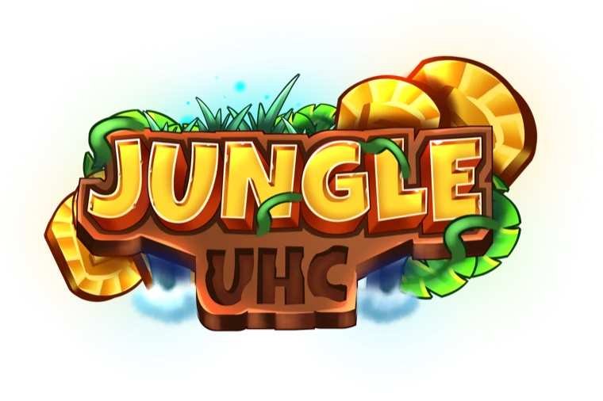

<div align="center">



# JungleUHC

Réseau UHC français depuis 2021. Modes de jeu maison, sur Minecraft 1.8.8.

</div>

## Le serveur est en bêta

```text
dev.jungleuhc.fr
```

Minecraft 1.8.8. Les parties sont annoncées sur le [Discord](https://discord.jungleuhc.fr).

## Loup-Garou UHC

Notre propre variante du mode de jeu, basée sur sa saison 9.

<div align="center">

[Présentation](https://docs.jungleuhc.fr/loup-garou-uhc/presentation/) · [Rôles](https://docs.jungleuhc.fr/loup-garou-uhc/roles/) · [Évènements aléatoires](https://docs.jungleuhc.fr/loup-garou-uhc/evenements-aleatoires/) · [Commandes](https://docs.jungleuhc.fr/loup-garou-uhc/commandes/)

</div>

## Autres modes de jeu

D'autres modes sont en écriture et en développement. Ils sont annoncés sur le [Discord](https://discord.jungleuhc.fr) quand ils sont jouables.

## Rejoindre l'équipe

On cherche régulièrement des développeurs, des modérateurs, des rédacteurs et des graphistes.

Le projet vous tente ? Venez en discuter sur notre [Discord](https://discord.jungleuhc.fr) 😉
